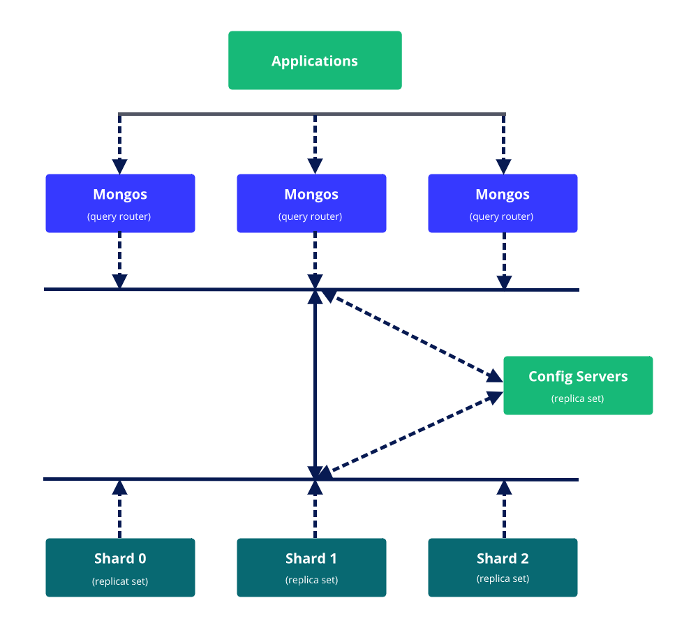

## Overview

This is an example of a MongoDB sharded cluster that's protected with SSL, like a lock for safety. All the pieces of this cluster will work together on just one machine. Each piece starts in its own way, using a different path and spot.

The cluster is split into three smaller groups, sort of like dividing things into three parts. Each of these groups is called a shard. Inside each shard, there's a main member and two backup members, kind of like a team working together.

If you want to learn more, you can read the article for all the details, [Create a MongoDB sharded cluster with SSL enabled](https://hackernoon.com/create-a-mongodb-sharded-cluster-with-ssl-enabled-dace56bc7a17).

### Architecture



### Pre-requisites

* MongoDB - (Should support any version that support TLS)
* OpenSSL
* NodeJS
* Bash

### Step-1: Prepare SSL certificates

When you're using MongoDB for serious work, it's important to have proper certificates that are approved by a special certificate authority. This could be certificates made by your group or a company that's trusted to handle these certificates. To help you out, we have a script that makes certificates. You can use it to create a certificate for your web app and another one for managing the cluster. This way, everything stays secure and organized.

```bash
bash scripts/generate-certificate.sh
```

output would be something like:
```bash
Generating RSA private key, 4096 bit long modulus (2 primes)
......++++
...................................++++
e is 65537 (0x010001)
Generating RSA private key, 4096 bit long modulus (2 primes)
......................................................................................++++
.......++++
e is 65537 (0x010001)
Signature ok
subject=C = NL, ST = Nord Holland, L = Purmerend, O = Fluddi, OU = Database Instance, CN = *.fluddi.com, emailAddress = support@fluddi.com
Getting CA Private Key
Generating RSA private key, 4096 bit long modulus (2 primes)
..................................................................++++
...................................................................++++
e is 65537 (0x010001)
Signature ok
subject=C = NL, ST = Nord Holland, L = Purmerend, O = Fluddi, OU = DbAdmin, CN = *.fluddi.com, emailAddress = support@fluddi.com
Getting CA Private Key
Generating RSA private key, 4096 bit long modulus (2 primes)
....................................................................................................................................................................................++++
........................++++
e is 65537 (0x010001)
Signature ok
subject=C = NL, ST = Nord Holland, L = Purmerend, O = Fluddi, OU = Webapp, CN = *.fluddi.com, emailAddress = support@fluddi.com
Getting CA Private Key
```

Copy all certificates to `/opt/mongodb/`, set only read permission for these certificates:
```bash
cp -R certificates/* /opt/mongodb/
cd /opt/mongodb/
chomod 400 *
```

[Follow this guide to understand how certificate generation works.](./self-signed-certificate.md)

### Step-2: Customize configs

Confs directory contains cluster components configurations, You can customize for your needs.
Make sure that your data directory & log directory have read & write permissions. By default, data directory pointed on `/data/mongodb/` & log directory pointed on `/var/log/mongodb/test-cluster/`.

### Step-3: Initiate the cluster

Review before run the init script, also configure data directory path & check directory permissions.

```bash
bash setup.sh
```

This will setup all replica sets & Sharded cluster. Also will create two user `Webapp` & `DbAdmin`. View all mongod & mongos processes

```bash
px aux | grep mongo
```

### Step-4: Connect to a mongos query router

```bash
mongosh --port 27018 --host database.fluddi.com --tls --tlsCertificateKeyFile /opt/mongodb/webapp.pem --tlsCAFile /opt/mongodb/CA.pem
```

Authenticate user

```bash
db.getSiblingDB("$external").auth(
  {
    mechanism: "MONGODB-X509",
    user: "emailAddress=support@fluddi.com,CN=*.fluddi.com,OU=Webapp,O=Fluddi,L=Purmerend,ST=Nord Holland,C=NL"
  }
)
```

Check cluster status

```bash
sh.status()
```

This will return something like this:

```bash
shardingVersion
{ _id: 1, clusterId: ObjectId("64ca6b24d2d60692d14254a9") }
---
shards
[
  {
    _id: 's0',
    host: 's0/database.fluddi.com:37017,database.fluddi.com:37018,database.fluddi.com:37019',
    state: 1,
    topologyTime: Timestamp({ t: 1690987364, i: 2 })
  },
  {
    _id: 's1',
    host: 's1/database.fluddi.com:47017,database.fluddi.com:47018,database.fluddi.com:47019',
    state: 1,
    topologyTime: Timestamp({ t: 1690987364, i: 6 })
  },
  {
    _id: 's2',
    host: 's2/database.fluddi.com:57017,database.fluddi.com:57018,database.fluddi.com:57019',
    state: 1,
    topologyTime: Timestamp({ t: 1690987364, i: 19 })
  }
]
---
active mongoses
[ { '7.0.0-rc10': 1 } ]
---
autosplit
{ 'Currently enabled': 'yes' }
---
balancer
{ 'Currently enabled': 'yes', 'Currently running': 'no' }
---
databases
[
  {
    database: { _id: 'config', primary: 'config', partitioned: true },
    collections: {
      'config.system.sessions': {
        shardKey: { _id: 1 },
        unique: false,
        balancing: true,
        chunkMetadata: [ { shard: 's0', nChunks: 1024 } ],
        chunks: [
          'too many chunks to print, use verbose if you want to force print'
        ],
        tags: []
      }
    }
  },
  {
    database: {
      _id: 'fluddi',
      primary: 's2',
      partitioned: false,
      version: {
        uuid: new UUID("46a04390-afc3-4839-afbe-0d03147c8d2e"),
        timestamp: Timestamp({ t: 1690987364, i: 22 }),
        lastMod: 1
      }
    },
    collections: {
      'fluddi.visitors': {
        shardKey: { siteId: 1, _id: 1 },
        unique: false,
        balancing: true,
        chunkMetadata: [ { shard: 's2', nChunks: 1 } ],
        chunks: [
          { min: { siteId: MinKey(), _id: MinKey() }, max: { siteId: MaxKey(), _id: MaxKey() }, 'on shard': 's2', 'last modified': Timestamp({ t: 1, i: 0 }) }
        ],
        tags: []
      }
    }
  }
]
```

### Step-5: Modify chunk size

Make chunk size smaller for demonstration purpose otherwise, you will need to generate a huge volume of data.
This is only for demonstration purpose, don't do this in production.

```bash
use config
db.settings.save( { _id:"chunksize", value: 8 } )
```

Now chunk size will be 8MB.

### Step-6: Generate some dummy data to the cluster

Install nodejs:
```bash
bash scripts/install_node.sh
```

* Configure .env file, follow .env.example
* Install packages, use `npm i` or `yarn`
* Run `node data-seeder/main.js`, this will generate 50000 visitor records

### Others

#### Check cluster status

```bash
sh.status()
```

#### Gracefully shutdown cluster

Execute following commands from mongos

```bash
sh.stopBalancer()

# Use sh.getBalancerState() to verify that the balancer has stopped.
sh.getBalancerState()

# Now shutdown server
db.getSiblingDB("admin").shutdownServer()
```

#### Start the sharded cluster

```bash
bash start.sh
```

#### Modify chunk size

```bash
use config
db.settings.insertOne( { _id:"chunksize", value: 8 } )
```

#### Disable Balancing

```bash
sh.disableBalancing( "test.visitors")
```

### License

This project is licensed under the MIT License - see the [license.md](./license.md) file for details
